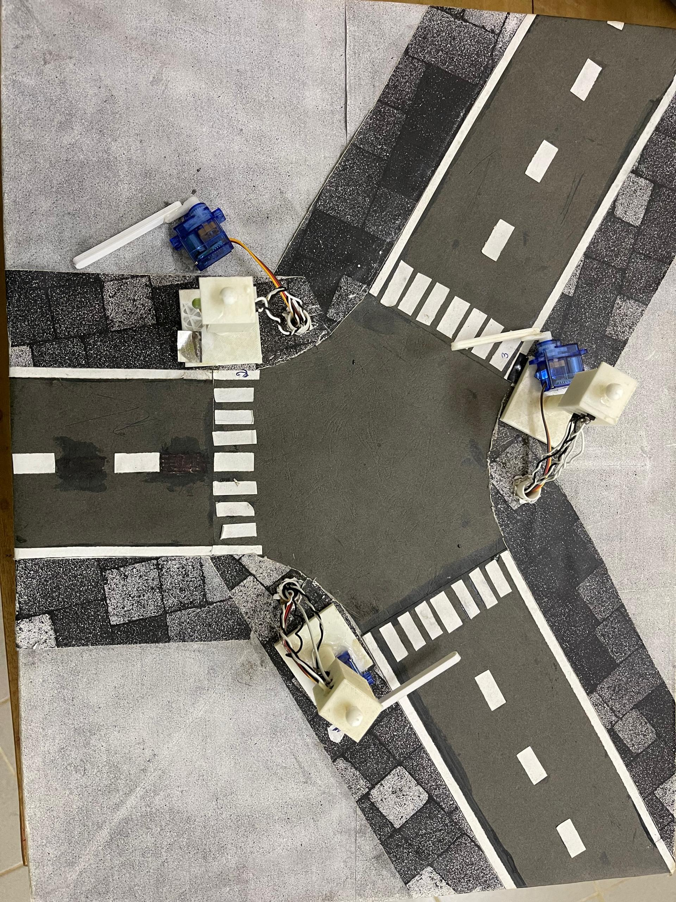
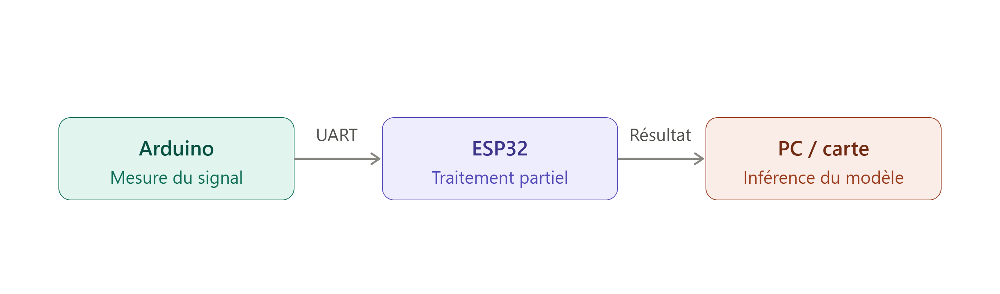

**PROJET** **FEUX** **TRICOLORES** **INTELLIGENTS** 

*Documentation*
*technique* *du* *projet*

**1.** **Contexte** **et** **motivation**

Au Bénin, un grand nombre d'accidents routiers est dû au non-respect des
feux de signalisation, et ce malgré la présence des forces de l'ordre.

Pour améliorer la sécurité routière, le projet propose un système
capable d'imposer physiquement l'arrêt des conducteurs grâce à une
barrière synchronisée avec les feux tricolores, tout en laissant passer
les véhicules prioritaires (VP) grâce à une détection intelligente.

**2.** **Objectifs**

**Objectif** **général**

Mettre en place un système automatisé permettant de réguler la
circulation en contraignant les usagers à respecter les feux tricolores
via une barrière mécanique pilotée par un microcontrôleur.

**Objectifs** **spécifiques**

- Détecter les véhicules prioritaires et leur attribuer un niveau de priorité. 

- Modéliser le système en 3D et fabriquer les pièces
 nécessaires.

- Concevoir le circuit électronique complet (capteurs, actionneurs, alimentation, VEROBOARD).

**3.** **Logique** **de** **fonctionnement**

Le système considère une intersection à trois voies. Chaque voie est
équipée :

- d'un feu tricolore,

- d'une barrière motorisée contrôlée par le microcontrôleur
- et d'un capteur de détection de véhicule prioritaire.

**Fonctionnement** **normal**

- Feu vert → barrière relevée.

- Feu rouge → barrière abaissée pour empêcher tout passage.

- Feu orange → barrière en cours de descente.

**Gestion** **des** **véhicules** **prioritaires** **(VP)** 

Lorsqu'un véhicule prioritaire est détecté sur une voie :

- si le feu est rouge, il passe automatiquement au vert et la barrière se relève ; 
- les autres voies passent au rouge et leurs barrières se
 baissent ;

- en cas de détection simultanée de plusieurs véhicules prioritaires,
 le système choisit automatiquement celui ayant la priorité la plus
 élevée.

**4.** **Étapes**

Progrès actuels : un prototype du système a été réalisé en carton,
recouvert de papier, avec feux et barrières imprimés en 3D. L'algorithme
de gestion des feux et des barrières est déjà implémenté sous Arduino.

**Étape** **1** **—** **Reprise** **et** **amélioration** **du**
**code** **actuel** **(1** **semaine)**

Consolidation et optimisation du code Arduino existant pilotant le
prototype à trois voies.

**Étape** **2** **—** **Reconnaissance** **des** **véhicules**
**prioritaires** 

Deux approches sont envisagées.

**Méthode** **1** **:** **Détection** **par** **reconnaissance**
**sonore** **via** **IA** **(3** **semaines)**

- Identifier les grandeurs mesurables permettant de caractériser un
son (fréquence, intensité, spectre, MFCC, etc.).

- Étudier le fonctionnement du capteur audio.

- Collecter les sons des différents véhicules prioritaires locaux (ambulance béninoise, police, sapeurs-pompiers...).

- Réaliser une analyse exploratoire (spectrogrammes, MFCC, pics fréquentiels)
- Choisir un modèle adapté (CNN 1D, CNN 2D avec spectrogrammes, LSTM, etc.). 
- Entraîner, valider et tester le modèle.

**Méthode** **2** **:** **Détection** **par** **capteur** **de**
**reconnaissance** **vocale** **(2** **semaines)**

- Étudier le fonctionnement du capteur et valider sa compatibilité avec le microcontrôleur.

- Collecter les sons des véhicules prioritaires.

- Tester la reconnaissance en conditions réelles d'intersection.

**Étape** **3** **—** **Intégration** **complète** **dans**
**l'algorithme** **de** **contrôle** **(2** **semaines)**

- Synchronisation entre reconnaissance sonore, feux tricolores et barrières.

- Gestion des priorités multiples.

- Tests sur maquette.

**Étape** **4** **—** **Améliorations** **prévues**

**Ajout** **de** **relais** **pour** **transférer** **le** **son**
**jusqu'au** **microcontrôleur** 

Permet de stabiliser la capture audio et d'éviter les perturbations.

**Ajout** **d'une** **caméra** **pour** **vérifier** **l'identité**
**du** **véhicule**

Ce point répond au cas de l'imposteur : 

- un véhicule non prioritaire
pourrait émettre une sirène artificielle pour tromper le système. 
- La caméra est placée à l'intersection des trois routes et peut effectuer
une rotation à 360°.

Ainsi :

- une caméra ou un lecteur code-barres / QR est ajoutée ;

- chaque véhicule prioritaire possède un identifiant visuel (QR,marque distinctive) ;

- si le son détecté ne correspond pas au véhicule vu par la caméra → suspicion d'imposture ; 

- le système peut alors capturer la plaque d'immatriculation pour enregistrement.

**Étape** **5** **—** **Modélisation** **3D** **et** **impression**

- Conception CAO complète du système (supports, feux, barrière,structure).
- Impression 3D des pièces.

**Étape** **6** **—** **Conception** **du** **circuit** **imprimé**
**(PCB)**

- Architecture électronique : capteurs audio, caméra, microcontrôleur, servomoteurs, relais... • Schéma électronique puis routage PCB.

- Fabrication et test.

- Utiliser une alimentation se chargeant à partir d'énergie solaire.

**5.** **État** **de** **l'art**

**Fabrication** **du** **système** **de** **3** **voies** **avec**
**carton** **et** **impression** **3D**

Le prototype actuel du système à trois voies a été réalisé en carton,
recouvert de papier, avec les feux et les barrières imprimés en 3D. Il
permet de valider la logique de fonctionnement (feux, barrières,
priorités) avant la fabrication d'un système à l'échelle réelle.

**Implémentation** **Arduino** **pour** **le** **système** **de** **3**
**voies**

L'algorithme de gestion des feux et des barrières est déjà implanté sur
Arduino et pilote le prototype à trois voies (logique feu vert / orange
/ rouge synchronisée avec la position des barrières sans la gestion des
véhicules prioritaires).

*Fichier source* : */codes_docs/feux_tricolores_simulation/feux_tricolores_simulation.ino*

**Code** **d'apprentissage** **du** **traitement** **de** **son**

Ce module concerne le traitement des signaux sonores captés en vue de la
reconnaissance des véhicules prioritaires (Méthode 1 de l'Étape 2 :
extraction de caractéristiques audio, MFCC, entraînement d'un modèle de
classification).Il vient avec un enregistrement d’un son grave comme
enregistrement de test.

*Fichier source : /codes_docs/MFCCs/MFCCsTest.ipynb*

**Document** **explicatif** **pour** **le** **traitement** **de**
**signal**

Ce document présente la méthode des coefficients cepstraux à fréquence
Mel (MFCC), utilisée pour caractériser les sons captés (sirènes des
véhicules prioritaires) avant leur classification par le modèle de
reconnaissance.

*Fichier source : /codes_docs/MFCCs/Traitement_de_son_MFCC.md*

**Capteur** **KY-038**

Il s’agit des informations récoltés et codes écrits pour la mesure des
signaux temporels des sons des véhicules via le capteur KY-038.

**Câblage,** **fonctionnement** **et** **image** **du** **capteur**

*Fichier source : /codes_docs/KY-038_capteur_son.md*

**Codes** **Arduino** **d'obtention** **du** **spectre** **temporel**

Ces codes permettent d'acquérir, via le capteur KY-038, le spectre
temporel du son capté, utile pour l'analyse exploratoire évoquée à
l'Étape 2.

En effet, en se basant sur les caratéristiques matériels et les exigences de
vitesse pour la reconnaissance en temps réel des véhicules prioritaires,
on a décidé qu’il serait mieux d’utiliser un ESP32 plutot qu’un Arduino
pour la mesure parce qu’il est plus rapide et plus performant. Mais il y
eu un problème de mesure lorsqu’on cablait directement le capteur KY-038
à l’ESP32 : les valeurs mesurées étaient constamment nulles. Donc pour
garder l’efficacité en terme de calcul de l’ESP32 et la mesure qui a pu
être testée avec l’Arduino, il a été décidé de faire communiquer par
série (**UART**) l’Arduinoetl’ESP32detelle faconquel’Arduinomesure le
signaletenvoie ces mesures à l’ESP32 qui lui gère une partie du
traitement dont le résultat est renvoyé vers l’ordinateur ou la carte
sur laquelle est inférée le modèle.

La figure suivante décrit le processus complet.

*Fichiers sources* :

\- */codes_docs/ESP32_spectre_temporel/ESP32_spectre_temporel.ino*

\-*/codes_docs/ARDUINO_spectre_temporel/ARDUINO_spectre_temporel.ino*

**Base** **de** **sons** **de** **véhicules** **prioritaires**

Les sons de certains véhicules prioritaires comme le SAMU, la police ont
été récupérés et enregistrés dans le dossier sons.

*Fichiers sources: /sons*

**11.** **Analyses** **globales**

**Analyse** **des** **contraintes** **et** **risques**

Ces éléments sont issus du rapport de réunion du projet :

- Priorité d'État : le projet, bien qu'utile, pourrait ne pas être
 considéré comme une priorité absolue pour l'État en termes de
 coût/utilité actuelle.

- Fiabilité des données : risque de construire une base de données
 erronée si les capteurs ne sont pas correctement calibrés par rapport
 aux standards commerciaux.

**Registre** **des** **questions** **posées**

Plusieurs interrogations critiques ont été soulevées, nécessitant des
réponses avant la phase suivante :

- Viabilité budgétaire : le coût total du projet est-il supportable si
 l'on doit déployer des moteurs, des barrières et des capteurs sur
 l'ensemble du réseau national ?

- Unité de mesure acoustique : quelle unité doit être utilisée pour
 les capteurs de son ? Le décibel (volume) ou l'unité d'amplitude
 sonore ?

- Capacité technique : les capteurs de son de base sont-ils suffisants
 pour les besoins du projet ?

- Spécifications des radars : quelle est la distance maximale de
 capture des radars pour les véhicules en mouvement ?

Pour rappel,les pistes techniques suivantes ont égalementété discutées
en réunionpour renforcer le système :

- Intégration de radars et caméras : ajout de radars pour détecter les
 excès de vitesse en amont et de caméras pour identifier les plaques
 d'immatriculation en cas d'infraction au feu rouge.

- Optimisation du radar : utilisation de radars capables de flasher à
 une distance maximale pour anticiper le freinage des conducteurs.

- Étalonnage des capteurs de son : utilisation d'un capteur commercial
 standard comme référence pour vérifier la précision des valeurs
 enregistrées par le prototype dans la base de données.

- Protocole de communication : utilisation de protocoles comme l'I2C
 ou la communication série pour lier les composants électroniques.

- Priorité à la barrière physique : l'usage d'une barrière est jugé
 plus efficace que les simples caméras (utilisées aux USA) car elle
 impose l'arrêt physique du véhicule.

**12.** **Propositions** **de** **nouvelles** **orientations** **pour**
**le** **projet**

**1.** **Continuité** **du** **travail** **sur** **le** **modèle** **de**
**reconnaissance** **de** **son**

**2.** **Suppression** **des** **barrières** **et** **remplacement** **par**
**une** **méthode** **basée** **sur** **la** **détection** **de**
**plaque** **d'immatriculation** **par** **caméra**

Cette orientation ferait évoluer le système d'un dispositif de
contrainte physique (barrière) vers un dispositif de contrôle a
posteriori par caméra, à l'image des systèmes utilisés aux États-Unis
évoqués en réunion. Elle s'appuierait sur la brique caméra déjà
envisagée à l'Étape 4 (identification visuelle des véhicules, capture de
plaque d'immatriculation en cas d'infraction ou de suspicion
d'imposture). 

***Note*** ***:*** *Cette* *piste* *répond* *en* *partie* *à* *la*
*question* *de* *viabilité* *budgétaire* *soulevée* *en* *réunion,*
*une* *caméra* *pouvant* *être* *moins* *coûteuse* *à* *déployer* *à*
*grande* *échelle* *qu'une* *barrière* *motorisée,* *au* *prix* *d'un*
*contrôle* *non* *plus* *préventif* *mais* *répressif.*

**3.** **Modèle** **d'IA** **de** **gestion** **de** **la** **densité** **du**
**trafic**

Il s’agit de développer un modèle d’IA particulièrement par
apprentissage par renforcement pour gérer la congestion du traffic de
manière optimale et automatique.

**4.** **Fabrication** **locale** **des** **Feux** **Tricolores**

Cette suggestion s’oriente dans la direction de la fabrication de Feux
tricolores en exploitant les matériaux disponibles au Bénin.
