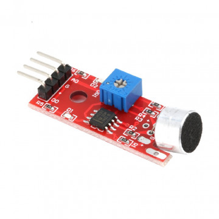
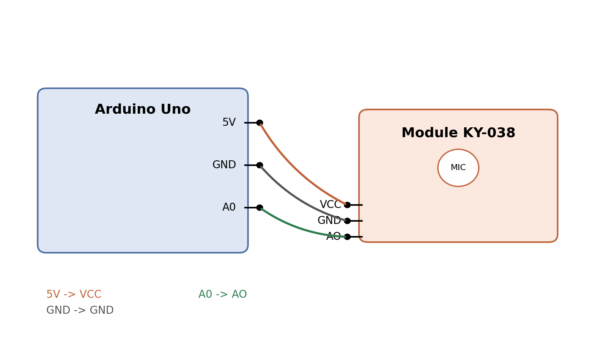

# Le capteur de son KY-038

Ce document présente le module KY-038, son fonctionnement, son câblage avec une carte Arduino, et son utilité pour mesurer un niveau sonore en continu plutôt que pour simplement détecter la présence d'un bruit.



## Schéma de câblage



## Fonctionnement

Le KY-038 est un petit module équipé d'un microphone électret. Le son capté par le microphone est converti en une tension électrique, puis amplifiée par un amplificateur opérationnel intégré sur le module. Cette tension amplifiée est disponible en continu sur la broche AO : plus le son est fort, plus la tension (et donc la valeur lue) est élevée.

Le module comporte aussi un comparateur (LM393) associé à un potentiomètre. Ce circuit compare le niveau sonore à un seuil réglable et bascule la broche DO à l'état haut lorsque ce seuil est dépassé. C'est cette sortie DO qui sert à la détection de bruit (oui/non), et qu'on laisse ici volontairement inutilisée.

## Brochage et câblage avec l'Arduino

| Broche KY-038 | Broche Arduino | Rôle | Remarque |
|---|---|---|---|
| VCC | 5V | Alimentation | 3,3 V possible |
| GND | GND | Masse commune | Obligatoire |
| AO | A0 | Signal analogique | Utilisé ici |
| DO | non connecté | Sortie seuil tout ou rien | Non utilisé ici |

## Utilité pour la mesure d'un son (et non la détection de bruit)

- La broche AO fournit une valeur continue proportionnelle à l'intensité sonore, contrairement à DO qui ne donne qu'une information binaire (seuil dépassé ou non).
- Cela permet de suivre l'évolution du niveau sonore dans le temps, par exemple pour tracer une courbe ou calculer une moyenne.
- La broche DO est donc ignorée ici puisqu'elle ne convient qu'à une détection simple de dépassement de seuil, pas à une véritable mesure.

## Code Arduino simple

```cpp
// Lecture simple du niveau sonore avec le KY-038
const int pinAO = A0; // sortie analogique du capteur

void setup() {
  Serial.begin(9600);
}

void loop() {
  int valeur = analogRead(pinAO); // 0 a 1023
  Serial.println(valeur);          // affiche le niveau sonore
  delay(100);
}
```
