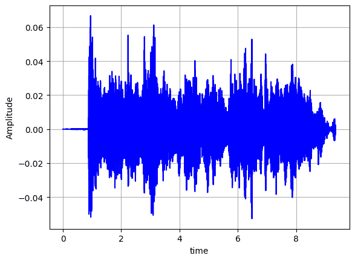
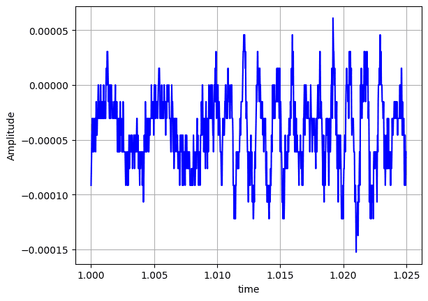
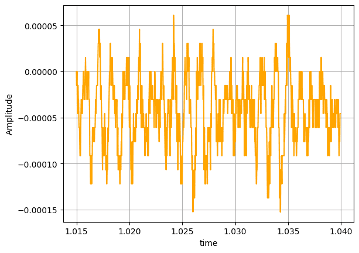
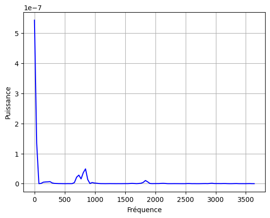
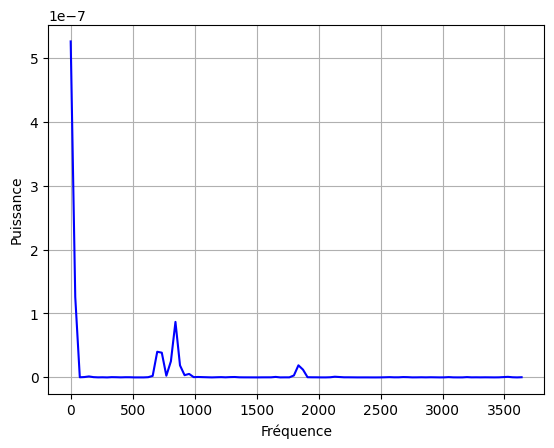
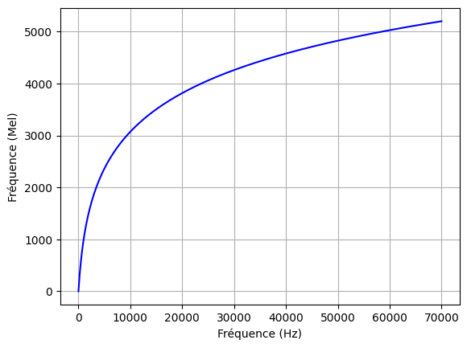
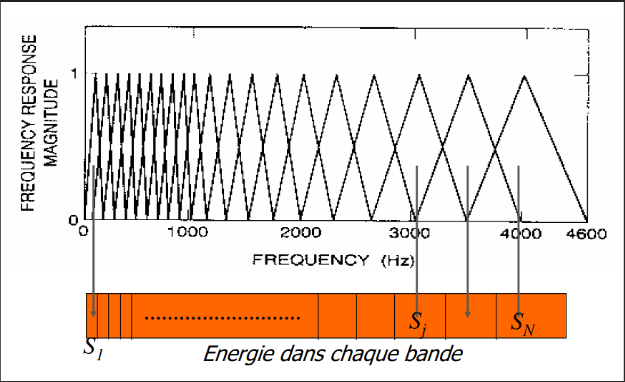

# Traitement de son (MFCC)

## a. Etude théorique

Comment distinguer un son d’un autre? Quelles valeurs mesurables peuvent être considérée  comme signature d’un son?

Les **MFCCs (Mel Frequency Cepstral  Coefficients)**  arrivent à capturer les trois principales caractéristiques d’un son :

-les harmoniques (les fréquences qui constituent ce son)

-l’intensité relative de ces harmoniques 

-leur dynamique temporel (comment évoluent ces harmoniques dans le temps )

## **Etapes de détermination des MFCCs**


>**Signal numérique x[n]**
>
>**Découpage en frames de (20-25ms) espacées de 10 ms**
>
>**Fenêtrage de Hamming** 
>
>**FFT (Fast Fourier Transform)**
>
>**Banques Filtres de Mel**
>
>**Spectrogramme de Mel**
>
>**DCT( Transformée Discrète de Cosinus )**
>
>**MFCCs (coefficients décorrélés )** 


Tout commence à partir d’un son qui, lorsqu’il est émis, applique une pression dans l’air mesurée, par un capteur ou un micro à une fréquence donnée. Cette fréquence est appelée **Fréquence d’échantillonnage(Fe).** Grâce à ce capteur, on obtient le son sous forme de fichier binaire avec une extension comme .wav, .aac, .mp3, .mp4 et autre. L’extension utilisée pour faire du traitement audio est le **.wav**.

### **Signal numérique x[n]**

- Un fichier .wav se présente comme suit :

```
En tête: Fe 
x[0],x[1],x[2],x[3],....
```

1. **Fe** :  est la fréquence d’échantillonnage 
2. **x[k]:** il s’agit de la mesure de l’amplitude du son à un instant **k*Te** avec **Te** la période de mesure **(Te =1/Fe)**.

Par exemple,

**x[0]:** amplitude du son à 0 s

**x[1] :** amplitude du son à 1/Fe s

**x[2]:** amplitude du son à 2/Fe s

Et donc la suite de mesures d’amplitude **x[0],x[1],x[2],x[3],....** est le **signal numérique** .Le signal numérique , c’est donc la courbe de l’amplitude du son en fonction du temps.

C’est à partir du signal et de la fréquence d’échantillonnage Fe que tout le travail est développé. Donc la raison pour laquelle l’extension **.wav** est la plus utilisée en traitement audio est liée à la simplicité de l’extraction des données essentielles pour ce type de traitement.

Voici le signal numérique d’un son grave enregistré par moi: 



### Découpage en frames de (20-25ms) espacées de 10 ms

Après avoir extrait le signal sonore , il faudra procéder à un découpage de ce dernier en de petits morceaux (**frame**) de même taille **entremêlés** lorsqu’ils sont consécutifs et espacés d’un pas. Il faut préciser que :

- la **taille d’une frame** ici fait référence au nombre de mesures d’amplitude par frame
- le **pas** revient au nombre de mesure d’amplitude qui séparent deux frames consécutives.

Donc on considère un son :

```
Fe:16000 (Hz)
x[0],x[1],x[2],x[3],...
```

Visuellement , les frames se présentent comme suit:

```
Frame 1:
x[0],x[1],x[2],x[3],...,x[N-1] avec N=taille_frame
Frame 2:
x[0],x[1],x[2],x[3],...,x[N-1] avec N=taille_frame
```

Les indices utilisées sont propres à chaque frame et ne correspondent pas à la position générale des échantillons dans tout le signal numérique . 

Habituellement, on prend 25 ms comme la durée de chaque frame et 10 ms comme le pas. 

```
taille_frame=0.025*Fe =0.025*16000=400

pas=0.010*Fe=0.010*16000=160

overlap=time_frame-pas_time=25-10=15 (recouvrement)

taille_overlap=overlap*Fe=0.015*16000=240
```

Chaque frame sera donc formé de 400 échantillons. L’expression “*espacés de 10 ms*” signifie qu’à partir de la 15 (overlap) ième ms de la frame précédente, la frame suivante débute . Donc ca veut dire que deux frame successives partage 240 échantillons.

Ici , vous pouvez visualiser deux frames correspondant respectivement aux périodes [1.00, 1.025] et [1.015,1.040].

**Frame 0**




**Frame 1**




Il s’agit bien de deux frames successives.

![frame[1,1,040].png](../../Images/frame11040.png)

Sur l’image juste au dessus , vous pouvez visualiser le recouvrement (**overlap**) entre ces deux frames. 

Si vous avez compris ca , alors la question que vous allez poser ,c’est : **Pourquoi découpe  t-on des frames de 25 ms avec un pas de 10 ms ?**

**Raisons**

- **Fenêtre de 25 ms (Frame Length)** : On découpe le signal en segments de 25 ms car le signal de parole est considéré comme "stationnaire" (ses propriétés statistiques ne changent pas trop) sur de très courtes durées. Cela permet d'appliquer une transformée de Fourier efficace.
- **Pas de 10 ms (Frame Stride / Hop Size)** : Le "pas" de 10 ms signifie qu'on commence une nouvelle frame toutes les 10 ms. Comme la fenêtre dure 25 ms, il y a un **recouvrement (overlap)** de 15 ms entre deux fenêtres successives. Ce recouvrement est crucial pour ne pas perdre d'information aux transitions et pour assurer une continuité lors de l'analyse fréquentielle.

Donc on vient de découper notre signal numérique en H frames, chacune de N échantillons. On passe alors au fenêtrage d’Hamming.

### **Fenêtrage de Hamming**

La fenêtre d’**Hamming** est définie comme suit:

$$
w[n] = 0.54 - 0.46 \cos\!\left(\frac{2\pi n}{N-1}\right), \quad 0 \le n \le N-1
$$

Le but est de rendre N-périodique  chaque frame du signal et d’adoucir les bords de chaque frame. Vous allez me demander pourquoi?

**Simple!!!**

En effet, après l’étape du découpage en frame , il y aura l’application de la transformée de Fourier pour obtenir le spectre fréquentiel (le diagramme des fréquences du son). Cette transformée suppose que le signal sonore entier  est **N-périodique** parce qu’elle le projette sur des sinusoides N-périodiques. Cela veut dire que toutes les frames se ressemblent et que les bords de chaque frame sont continues.

Visuellement c’est que:

```
Pour k entre 0 et N-1,
x[k]=x[k+N]

et que x[0] = x[N-1]
```

Voici l’image des deux frames précédentes après le fenêtrage d’Hamming:

**Frame 0**

![fenatrageHammingFrame[1,1.025].png](../../Images/fenatrageHammingFrame11.025.png)


**Frame 1**

![fenatrageHammingFrame[1.015,1.040].png](../../Images/fenatrageHammingFrame1.0151.040.png)


On peut voir sur les deux tracés que les deux frames se ressemblent( la N-périodicité ). Aussi, les bords de deux frames sont pratiquement nuls assurant ainsi la continuité. Passons à l’étape la plus importante de tout le traitement : la transformée discrète de Fourier .


## FFT (Fast Fourier Transform)

**FFT** (Fast Fourier Transform) est le programme le plus rapide pour déterminer la transformée de Fourier discrète (**DFT** en anglais).  

On considère une frame **i** parmi les H frames et contenant N mesures d’amplitude. 

On définit la FFT par : 

$$
X[k] = \sum_{n=0}^{N-1} x[n]\, e^{-j \frac{2\pi}{N}kn}, \quad 0 \le k \le N-1
$$

Avec : 

**k** : l’indice de la fréquence ( **fk = k*Fs/NFFT** ) avec NFFT≥ N 

**x[n]** : l’amplitude mesurée à l’instant **nTe** avec **Te = 1/Fs**

**X[k]** : nombre complexe 

#### C’est quoi X[k]?

Il correspond au nombre de sinusoïdes de la fréquence **fk** dans le signal.  Plus simplement, **X[k]** représente l’importance de la fréquence **fk** dans le son.

Nous avons : 

**X[k]** : le nombre complexe avec une amplitude et une phase 

**|X[k]|**: l’amplitude de la fréquence

**|X[k]|²**: l’énergie de cette fréquence dans le son

A partir de la FFT , on ne parlera plus du signal temporel qui est la suite d’amplitudes du son à un instant nTe mais plutôt du spectre fréquentiel qui est la suite de nombres complexes représentant l’énergie  de chaque fréquence dans le signal.

**Signal temporel :**

$$
x[0],\, x[1],\, \dots,\, x[N-1]
$$

**Spectre fréquentiel :**

$$
X[0],\, X[1],\, \dots,\, X[N-1]
$$

Cette représentation du spectre fréquentiel n’est pas purement juste. C’est plutôt ca:

$$
|X[0]|^2,\, |X[1]|^2,\, \dots,\, |X[N-1]|^2
$$

Voici le spectre fréquentiel des deux précédentes frames d’un son:

**Frame 0**



**Frame 1**
    




#### Remarque

Il est important de préciser qu’on ne prend que les NFFT/2 premières X[k] parce que la FFT est symétrique.

## Banques Filtres de Mel

Les **banques de filtres Mel** sont le **cœur concret** de l’échelle Mel dans les MFCC.

### **Pourquoi a-t-on besoin de banques de filtres ?**

Après la **FFT**, on obtient un **spectre fréquentiel** :

- très détaillé
- avec **des milliers de fréquences** (en Hz)
- trop précis pour être robuste ou utile directement

Problème :

l’oreille humaine **ne distingue pas chaque Hz**
elle regroupe les fréquences proches

Les banques de filtres Mel font exactement ce regroupement.

### **Qu’est-ce qu’une banque de filtres Mel ?**

Une **banque de filtres Mel** est :

- un ensemble de **filtres passe-bande**
- généralement **triangulaires**
- disposés sur l’axe fréquentiel

Chaque **filtre** :

- couvre une **bande de fréquences**
- produit **un seul nombre** = l’énergie dans cette bande

### **Pourquoi des filtres triangulaires ?**

- simples à calculer
- recouvrement progressif
- transition douce entre bandes (puisque deux bandes successives se recouvrent)

On comprend qu’avec ce type de filtres, qu’une fréquence proche du centre a plus de poids qu’une fréquence éloignée du centre. Cela reflète parfaitement la perception humaine.

### **Placement des filtres : l’idée clé**

Les filtres sont :

- **uniformément espacés en Mel (échelle de Mel)**
- mais **non uniformément espacés en Hz**

**Conséquence directe :**
 

- **basses fréquences** → filtres **étroits et nombreux**
- **hautes fréquences** → filtres **larges et peu nombreux**

Ce qui correspond exactement au comportement de l’oreille.  

En effet, l’oreille humaine a plus d’aisance à distinguer les sons graves que les sons aigus. Autrement dit, deux sons aigus avec des fréquences proches sonneraient pareilles à notre oreille à la différence de deux sons graves. C’est une observation expérimentale du fonctionnement de l’oreille interne (**la cochlée**).

### **Construction étape par étape des filtres de Mel**

#### Conversion Hz → Mel

Voici la formule de conversion du Hz en Mel (passer de l’échelle de fréquence en Hz à celle en Mel)

$$
f_{\text{mel}} = 2595 \log_{10}\left(1 + \frac{f}{700}\right)
$$

On comprend à partir de la formule que l’échelle de Mel est non linéaire (présence du logarithme). 

Si vous effectuez quelques conversions en Mel, vous verrez que plus les fréquences augmentent , moins espacées elles sont c’est à dire que pour les basses fréquences, les valeurs en Mel sont espacées presque linéairement, mais pour les hautes fréquences , les valeurs en Mel sont très proches. 

Voici la courbe de la fonction **fmel** sur **[0,70000]**:



On peut voir sur la courbe qu’au début, la courbe ressemble à une droite mais qu’après (hautes fréquences), elle semble se rapprocher d’une valeur constante.

#### Conversion Mel → Hz

$$
f = 700 \left(10^{\frac{f_{\text{mel}}}{2595}} - 1\right)
$$

#### Définir les bornes fréquentielles

Ici on définit les valeurs minimale et maximale de la frame.

$$
f_{\min} = 0
$$

$$
f_{\max} = \frac{F_s}{2}
$$

#### Conversion des bornes en Mel

$$
m_{\min} = 2595 \log_{10}\left(1 + \frac{f_{\min}}{700}\right)
$$

$$
m_{\max} = 2595 \log_{10}\left(1 + \frac{f_{\max}}{700}\right)
$$

#### Création des points Mel uniformes

(Si on veut M filtres, il faut M+2 points)

$$
m_i = m_{\min} + i \cdot \frac{m_{\max} - m_{\min}}{M+1}, \quad i = 0,1,\dots,M+1
$$

#### Conversion des points Mel en Hz

$$
f_i = 700 \left(10^{\frac{m_i}{2595}} - 1\right)
$$

Les fi entre [1,M] correspondent aux fréquences centrales des différents filtres. 

#### Conversion Hz → indices FFT

(Si la FFT a une taille N)

$$
k_i = \left\lfloor \frac{N \cdot f_i}{F_s} \right\rfloor
$$

#### Définition du filtre triangulaire

Pour le filtre ( la formule théorique):

$$
H_m(f) =\begin{cases}0 & f < f_{m-1} \\\frac{f - f_{m-1}}{f_m - f_{m-1}} & f_{m-1} \le f \le f_m \\\frac{f_{m+1} - f}{f_{m+1} - f_m} & f_m \le f \le f_{m+1} \\0 & f > f_{m+1}\end{cases}
$$

De manière pratique, c’est à dire dans l’implémentation des poids, on utilise les indices k et non les fréquences même.

$$
H_m(k) =
\begin{cases}
0 & k < k_{m-1} \\
\frac{k - k_{m-1}}{k_m - k_{m-1}} & k_{m-1} \le k \le k_m \\
\frac{k_{m+1} - k}{k_{m+1} - k_m} & k_m \le k \le k_{m+1} \\
0 & k > k_{m+1}
\end{cases}
$$

Sur l’image ci dessous , vous pouvez visualiser les filtres triangulaires qui, comme on l’aurait compris plus haut, sont plus nombreux et plus étroits au niveau des basses fréquences et moins nombreux et plus élargis au niveau des hautes fréquences :

 



## Spectrogramme de Mel

Après la construction des filtres de Mel, il faudra déterminer le spectrogramme de Mel. 

Il s’agit d’une matrice (2D) dont chaque ligne correspond à une frame donnée et chaque colonne correspond à un filtre . 

Les valeurs à l’intérieur de cette matrice correspondent à l’énergie globale d’un filtre donné pour une frame donnée. 

Chaque ligne est une suite de **(log(Em))m** avec les **Em** qui sont calculés par la formule suivante:

Si **|X(k)|²** est le spectre de puissance :

$$
E_m = \sum_{k=0}^{N-1} |X(k)|^2 \cdot H_m(k), \quad m= 1,\dots,M
$$

- **|X(k)|²** : l’énergie de chaque fréquence dans le signal ( dans la frame)
- **Hm(k)** : le poids de chaque fréquence **fk** dans le filtre m

Vous pourrez visualiser le spectrogramme de Mel au cours de la partie pratique . Passons à l’étape décisive pour l’obtention de coefficients **cseptraux** efficaces et utilisables pour l’entrainement. 

## DCT( Transformée Discrète de Cosinus )

La transformée Discrète de Cosinus (DCT en anglais) est l’application définie comme suit:

A une matrice M **colonne  de m colonnes.**

$$
\mathbf{M_1,_m} =\begin{bmatrix}a_1 & a_2 & \cdots & a_m\end{bmatrix}
$$

Associe la matrice :

$$
\begin{bmatrix}a_1 & a_2 & \cdots & a_M\end{bmatrix}\begin{bmatrix}\phi_0(1) & \phi_1(1) & \cdots & \phi_K(1) \\\phi_0(2) & \phi_1(2) & \cdots & \phi_K(2) \\\vdots & \vdots & \ddots & \vdots \\\phi_0(M) & \phi_1(M) & \cdots & \phi_K(M)\end{bmatrix}=\begin{bmatrix}c_0 & c_1 & \cdots & c_K\end{bmatrix}
$$

avec :

$$
\phi_k(m) = \cos\left(\frac{\pi k}{M}\left(m - \frac{1}{2}\right)\right)
$$

et 

$$
c_k = \sum_{m=1}^{M} a_m \, \phi_k(m)
$$

Dans notre cas , on va considérer la matrice des logs des énergies:

$$
\mathbf{logE_m} =\begin{bmatrix}log(E_1) & log(E_2) & \cdots & log(E_m)\end{bmatrix}
$$

Et chaque **ck** sera défini par :

$$
c_k = \sum_{m=1}^{M} log(E_m) \, \phi_k(m)
$$

#### Pourquoi la DCT?

La principale raison qui justifie l’usage de la DCT est la décorrélation des coefficients **cseptraux**. 

En fait, si vous revoyez l’image présentant les différents filtres de Mel disposés sur l’axe des fréquences, vous allez remarquer que les filtres se recouvrent entre eux (particulièrement deux filtres successives). 

Ce recouvrement crée une corrélation entre les différentes énergies Em de chaque filtre. 

Cette corrélation provoquerait :

- une répétition des caractéristiques déterminées par les modèles CNN;
- un manque d’informations utiles pour caractériser chaque son ;
- une très mauvaise précision de la reconnaissance à cause de ce manque d’informations par le modèle des CNN.

Donc grâce à la DCT, les coefficients sont projetés sur des axes orthogonaux les rendant ainsi indépendants . 

Pour comprendre plus mathématiquement et avec plus de précision le lien entre la DCT et l’indépendance des **MFCCs**, recherchez la transformée de **Karhunen-Loueve**.

## MFCCs (coefficients décorrélés )

Il s’agit des coefficients **ck** obtenus grâce à la **DCT**. Il est important de préciser que l’on ne prend que les 12 premiers coefficients en dehors de c0 (puisque c0 représente l’énergie globale de toute la frame ). 

Voici un tableau récapitulant les 13 coefficients et leur signification physique à partir de c0:

| Coefficient | Nom courant | Information portée (interprétation physique) |
| --- | --- | --- |
| **c₀** | Énergie globale | Énergie moyenne du signal (souvent remplacé par log-énergie réelle) |
| **c₁** | Pente spectrale | Grave ↔ aigu (spectre montant ou descendant) |
| **c₂** | Courbure globale | Spectre plutôt creusé ou bombé |
| **c₃** | Structure large | Position générale des formants |
| **c₄** | Formants | Séparation grossière des formants |
| **c₅** | Formants | Détails moyens du timbre |
| **c₆** | Formants | Idem |
| **c₇** | Formants | Idem |
| **c₈** | Détails fins | Début des détails plus fins |
| **c₉** | Détails fins | Micro-variations spectrales |
| **c₁₀** | Bruit | Texture / rugosité |
| **c₁₁** | Bruit | Composantes rapides |
| **c₁₂** | Bruit | Détails très fins |

#### **Remarque**

La raison pour laquelle on ne choisit que les 12 premiers coefficients est simple.

 En fait, à partir de **c10**, les fonctions de la DCT présentent plus d’oscillations, donc les coefficients obtenus de la somme contiennent trop d’informations, ce qui rend difficile leur interprétation. C’est pour cela on les considère comme du bruit et on trouve suffisant le bruit déjà apporté par les c10, c11 et c12. En ajoutant, c13, c14, etc, ce serait trop de bruits dans nos données.

## b. Phase pratique

Pour cette partie, on aura besoin de la librairie **Librosa**. Je vous propose de créer un environnement Conda dans lequel vous installerai toutes les dépendances nécessaires.

## Installation de `librosa`

### 🔹 Méthode recommandée (pip)

Dans ton **terminal / invite de commande** :

```bash
pip install librosa
```

Si tu as **plusieurs versions de Python** :

```bash
python -m pip install librosa
```

ou

```bash
python3 -m pip install librosa
```

---

### 🔹 Dépendances importantes

`librosa` installe automatiquement :

- `numpy`
- `scipy`
- `soundfile`
- `audioread`

Si tu as une erreur liée à `soundfile`, installe-le explicitement :

```bash
pip install soundfile
```

---

### 🔹 Vérification

Dans Python :

```python
import librosa
print(librosa.__version__)
```

Si aucune erreur → ✅ installation réussie.

## Pratique proprement dit

Pour le reste , suivez les étapes dans le NoteBook qui vous  a été donné.